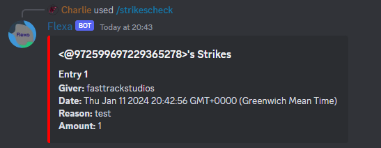

# Strikescheck

When executing the command /strikescheck it shows you an embed with all the strikes a user has in this specific server.

For example: /strikescheck fasttrackstudios and it would return this

